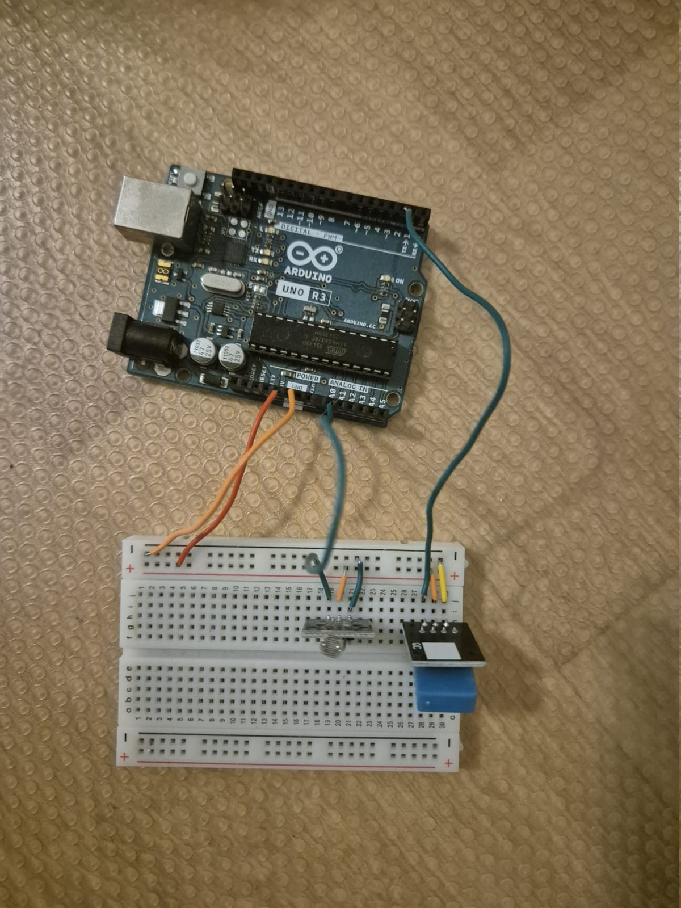

# Arduino-weather-station-with-live-data-visualisation
This project records environmental data(temperature, humidity and brightness) using an Arduino Uno and visualises it in a real-time python interface.
This project makes a complete data pipeline, from sensor input through serial communication to live data visualisation.

## Features
- real time visualisation of data
- Tab UI: *a tab showing all values and 3 seperate tabs showing each individual value*
- Shows a graph for each sensor using the history of the last 100 values
- Serial coummunication with error cases
- modular code(easily expandable)

## System Overview
The arduino reads the sensor data and sends it to the PC in a CSV Style over the serial connection. 
The Python script reads the data using **pySerial**, parses it, and creates a live graph using **Matplotlib** and **tkinter**.

### Screenshots of program
 this is a picture of the main tab(showing all 3 values), to see more go to [/images](/images)
 

## Hardware used
- Arduino Uno R3
- *DHT11 Temperature and Humidity sensor*
- *Light dependent resistor*
- USB Connection
- Breadboard

### Build:

## How to run it
To run the project follow these steps:
- Have Python 3.9 or higher installed
- Build the curuit and connect it to your PC
- Change the COM port in the Python script to the COM port your Arduino uses
- Upload the [main.ino script](arduino_code/main.ino) to your arduino
- run the [main.py script](python/main.py)
- open the new window to see the values

